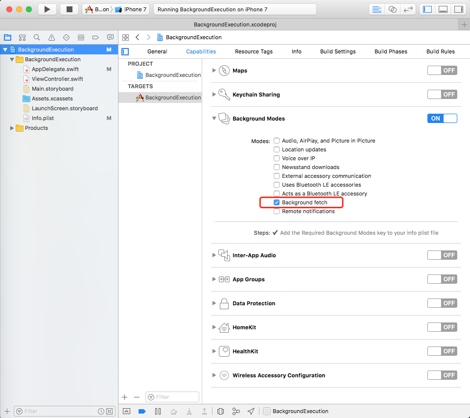

#iOS后台任务概述

##短时间的后台任务

当app进入到后台时，系统会将app挂起。如果这时app的一个任务刚好执行到一半，需要一点额外的时间来完成任务，可以使用`beginBackgroundTask`来启动后台任务。

###使用方法：

```
func applicationDidEnterBackground(_ application: UIApplication) {
    var bgTask = UIBackgroundTaskInvalid
    
    // 1、启动一个后台任务（不一定在app进入后台的时候调用）
    bgTask = application.beginBackgroundTask(withName: "MyTask") {
        
        // 4、如果到达最大的后台时间，任务还未完成，也必须结束任务
        application.endBackgroundTask(bgTask)
        bgTask = UIBackgroundTaskInvalid
    }
    
    DispatchQueue.global().async {
        // 2、执行实际的任务
        ···
        ···
        
        // 3、任务执行完，结束后台任务
        application.endBackgroundTask(bgTask)
        bgTask = UIBackgroundTaskInvalid
    }
}
```


1、调用`UIApplication.shared`的函数：`beginBackgroundTaskWithName:expirationHandler:`或`beginBackgroundTaskWithExpirationHandler:`启动一个后台任务，

2、执行实际的任务

3、任务执行完成之后，调用`UIApplication.shared`的函数` endBackgroundTask:`结束后台任务，app被挂起。另外，还能通过`UIApplication.shared.backgroundTimeRemaining`获得剩余的后台时间。

###特点：

* 不需要在info.plist中申请权限，
* 后台存活的时间有限（官方没有给出确切的时间，但实际测试是有180秒）
* 可以执行任何代码。


##后台传输服务（Background Transfer Service）
使用配置了支持后台传输的URLSession对象创建一个上传或下载任务，系统会在另一个进程执行这些传输任务。如果app进入挂起状态或被系统终止，传输任务会在后台继续。

1、创建一个支持后台传输的URLSession实例：

```
var backgroundSession: URLSession {
    let configuration = URLSessionConfiguration.background(withIdentifier: "com.yourcompany.appId.BackgroundSession")

    //  如果传输完成时，app不需在后台运行，可以设置为false
    configuration.sessionSendsLaunchEvents = true
    
    return URLSession(configuration: configuration, delegate: self, delegateQueue: OperationQueue.main)
}
```

2、创建传输任务（URLSessionDownloadTask或URLSessionUploadTask），并开启任务

```
func startBackgroundDownload() {
    let url = URL(string: "http://server/picture.png")
    let task = backgroundSession.downloadTask(with: URLRequest(url: url!)) { (data, response, error) in
        
    }
    task.resume()
}
```
3、如果当传输任务完成的时候，app仍在运行（不论后台还是前台），session对象都会调用delegate的相关函数。如果app被系统终止或被挂起，所有传输任务完成的时候，会调用`application:handleEventsForBackgroundURLSession: completionHandler:`方法，在这里更新app的UI界面。

```
func application(_ application: UIApplication, handleEventsForBackgroundURLSession identifier: String, completionHandler: @escaping () -> Void) {

    // 在这里更新UI
    // ...
    
    // 告诉系统后台传输已经完成，App Switcher会重新截取app的缩略图（双击home键能看到新的app界面）
    completionHandler();

    //You can also pop up a local notification to remind the user
    //...
}
```
后台传输完成时，如果app没有在运行，并且满足以下两个条件：

* URLSessionConfiguration的sessionSendsLaunchEvents设置为true
* app不是被用户杀掉的

系统会重新启动app，`application:handleEventsForBackgroundURLSession: completionHandler:`也就会在`application:didFinishLaunchingWithOptions:`之后调用。

###限制：

* 只支持http和https协议
* 只通过wifi来进行传输
* 系统会根据可用资源进行优化，无法保证后台传输任务一直在执行
* NSURLSessionDataTasks不支持后台传输

###一些应用场景：

* 后台下载一些大文件（如电影等），并在下载完成后发送一个本地推送，告知用户，获得良好的用户体验
* 配合下面的 [`Remote notifications`](#remote-notifications)(静默推送)，收到通知后，开启后台下载（如网盘数据有更新，）

##后台任务

| 后台模式 | UIBackgroundMode value | 描述 |
| --- | --- | --- |
| Audio and Airplay | audio | 音频播放、录音、AirPlay、picture in picture |
| Location updates | location | 在后台获取系统的定位更新 |
| Voice over IP | voip | 使用网络连接的电话服务 |
| Newsstand downloads | newsstand-content | 报刊杂志类应用 |
| External accessory communication | external-accessory | MFi（made for iOS） 外设通过蓝牙，或者 Lightning 接头等方式与 iOS 设备连接，从而可在外设发送消息时，唤醒已经被挂起的应用。唤醒后app有10秒时间处理数据，但可通过调用`beginBackgroundTaskWithExpirationHandler: `获取更多的时间 |
| Uses Bluetooth LE accessories | bluetooth-central | 此选项与 External Accessory communication 类似，只是此选项无需限制 MFi 外设，而需要的是 Bluetooth LE 设备。通过`Core Bluetooth framework`唤醒App |
| Acts as a Bluetooth LE accessory | bluetooth-peripheral |  iOS 设备作为一个蓝牙外设 |
| [Background fetch](#background-fetch) | fetch | 后台获取少量的数据 |
| [Remote notifications](#remote-notifications) | remote-notification | 静默推送 |


<a name="background-fetch"></a>
###background fetch

1、配置background fetch的权限



2、指定background fetch的时间间隔

```
func application(_ application: UIApplication, didFinishLaunchingWithOptions launchOptions: [UIApplicationLaunchOptionsKey: Any]?) -> Bool {
    application.setMinimumBackgroundFetchInterval(UIApplicationBackgroundFetchIntervalMinimum)
    return true
}
```
`UIApplicationBackgroundFetchIntervalMinimum `是告诉系统尽可能频繁地唤醒app
`UIApplicationBackgroundFetchIntervalNever`是设置不唤醒app，iOS 默认不进行后台获取

<a name="background-fetch-callback"></a>
3、实现AppDelegate的方法`application: performFetchWithCompletionHandler:`

```
func application(_ application: UIApplication, performFetchWithCompletionHandler completionHandler: @escaping (UIBackgroundFetchResult) -> Void) {
    
    //  执行获取数据的任务
    let configuration = URLSessionConfiguration.default
    let session = URLSession(configuration: configuration)
    let url = URL(string: "http://server/picture.png")
    let task = session.dataTask(with: URLRequest(url: url!)) { [unowned self] (data, response, error) in
        
        //  数据获取完成，执行background fetch完成的回调
        if let data = data {
            (self.window?.rootViewController as! ViewController).imageView.image = UIImage(data: data)
            completionHandler(.newData)
        }
        else {
            completionHandler(.failed)
        }
    }
    task.resume()
}
```
app被唤醒后会执行`application: performFetchWithCompletionHandler:`这个委托方法，并且最多有 **30秒** 的时间去获取数据并更新界面。

执行回调`completionHandler`的目的在于：

* 首先，系统会估量你的进程消耗的电量，并根据你传递的 UIBackgroundFetchResult 参数记录新数据是否可用。
* 双击home键，用户会看到新的app缩略图，即系统是通过`completionHandler`来报告并且生成截图的。

<a name="remote-notifications"></a>
###Remote notifications
1、与上面的`background fetch`一样开启`remote notification`权限

2、修改推送的payload。添加`content-available`，并设置为1，另外可以添加自定义的`content-id`，用于区分不同的事件，结果如下：

```
{
    "aps" : {
        "content-available" : 1
    },
    "content-id" : 42
}
```
在开发的时候，可以使用工具[Nomad CLI’s Houston](http://nomad-cli.com/)发送推送消息

3、当app收到一条带有 `content-avaiable` 的推送通知时，`application:didReceiveRemoteNotification:fetchCompletionHandler:`会被调用，后续操作与[background fetch的相关内容一致](#background-fetch-callback)

```
func application(_ application: UIApplication, didReceiveRemoteNotification userInfo: [AnyHashable : Any], fetchCompletionHandler completionHandler: @escaping (UIBackgroundFetchResult) -> Void) {
    
    //  根据contentID执行相关的操作
    let contetnID: Int = userInfo["content-id"] as! Int
    ···
    ···
    
    completionHandler(.newData)
}
```

##小结：
* 后台传输、`background fetch`和`remote notifications`在appDelegate对应的处理函数中都包含了一个后台完成的回调`completionHandler`，让系统更新app的界面截图，可以直接呈现最新内容，而不需用户重新打开app


##参考：
* [Background Execution](https://developer.apple.com/library/content/documentation/iPhone/Conceptual/iPhoneOSProgrammingGuide/BackgroundExecution/BackgroundExecution.html)
* [Background Modes Tutorial: Getting Started](https://www.raywenderlich.com/143128/background-modes-tutorial-getting-started)
* [iOS 后台运行实现总结](http://www.jianshu.com/p/d3e279de2e32)
* [iOS 7 的多任务](https://objccn.io/issue-5-5/)
* [WWDC 2013 Session笔记 - iOS7中的多任务](https://onevcat.com/2013/08/ios7-background-multitask/)