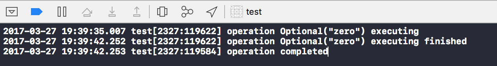

# Operation

`Operation` 可以理解为对一个任务的具体内容和涉及到的数据的封装。

官方定义
> The NSOperation class is an abstract class you use to encapsulate the code and data associated with a single task. 

NSHispter上的一篇文章对`NSOperation`的概况：
> NSOperation represents a single unit of work. It’s an abstract class that offers a useful, thread-safe structure for modeling state, priority, dependencies, and management.
其中提到了对`NSOperation `对任务状态的描述，优先级，依赖和管理。

## 使用要点：
1. `Operation`是一个用于抽象概念的类，不能直接使用，可以通过继承`Operation`或直接使用系统定义的子类(`NSInvocation​Operation`或	`Block​Operation`)
2. `Operation`对象不能重复执行
3. 通过将`Operation `子类对象加入到[`OperationQueue`](https://developer.apple.com/reference/foundation/operationqueue)中（一个优先队列）来执行一个任务。或直接调用`Operation `子类对象的`start`函数。推荐用第一种方式，第二种方式会增加一些额外的代码。

## 继承

继承`Operation`类来自定义任务是`Operation`的常用的使用方式。相对于直接使用系统定义的子类(`NSInvocation​Operation`或	`Block​Operation`)的方式，继承的方式的优点是可以重用自定义的`Operation`类。

`Operation`有一个属性`isAsynchronous`指定`Operation`是不是异步的。继承根据`Operation`是**异步**还是**同步**的可分为两种：

### 同步
1. 重写 main() 函数，给出具体的任务
2. 对于自定义的getter和setter需保证线程安全

### 异步
至少重写以下函数：

* start()
* isAsynchronous
* isExecuting
* isFinished

start() 函数的任务：

1. 启动一个异步的任务
2. 更新`isExecuting`的值，发送关于`isExecuting `值更新的KVO通知。同时`isExecuting`属性需保证线程安全

当`Operation`被取消或完成，`Operation`对象需更新`is​Executing`和`is​Finished`，并发送相关的KVO通知

## 状态
`Operation `对象跟状态有关的有以下几个属性，都是read-only属性，可通过KVO与外界进行信息交流：

* is​Ready
* is​Executing
* is​Cancelled
* is​Finished

状态转化如下:

> ready → executing → finished

### isReady
当operation的所有依赖都已经执行结束的时候，operation的状态才会变为ready，进入可执行状态。

Operation Dependencies （任务的依赖），可用于指定任务的执行顺序。`Operation`中跟依赖相关的属性和函数如下：

```swift
open func addDependency(_ op: Operation)       // 添加依赖 
open func removeDependency(_ op: Operation)    // 移除依赖
open var dependencies: [Operation] { get }     // 任务的所有依赖
``` 

### is​Executing
任务正在执行时返回true

### is​Cancelled
调用`Operation.cancel()`取消一个任务

### is​Finished
当任务执行完成或被取消，isFinished返回true

## 其他属性

### completionBlock
当`operation`对象的`isFinished`	属性为true时调用。注意：`isFinished`为true时，`operation`可能执行完成或被取消

### waitUntilFinished 
阻塞当前线程，直到`Operation`完成，如

```swift
import UIKit

class SimpleOperation: Operation {
    
    override func main() {
        NSLog("operation \(name) executing")
        sleep(3)				// 三秒后任务结束
        NSLog("operation \(name) executing finished")
    }
}

class ViewController: UIViewController {
    
    lazy var operationQueue: OperationQueue = {
        let queue = OperationQueue()
        queue.name = "queue"
        return queue
    }()

    override func viewDidLoad() {
        super.viewDidLoad()
        
        let operation = SimpleOperation()
        operation.name = "zero"
        
        operationQueue.addOperation(operation)
        
        operation.waitUntilFinished()	// viewDidLoad 被阻塞
        
        NSLog("operation completed")		// 直到operation的main()执行完成，才打印"operation completed"

    }
}

```
控制台输出如下：



### queuePriority 和 qualityOfService
`queuePriority ` 用于指定`Operation`在`OperationQueue`中的优先级，有以下优先级：

```swift
public enum QueuePriority : Int {

    case veryLow

    case low

    case normal

    case high

    case veryHigh
}
```

`qualityOfService ` 用于指定服务质量，即能获得的系统资源的多少，详见 [QoS](https://github.com/viciwang/notes/blob/master/contens/gcd/gcd.md#quality-of-service-qos)


##参考：

* [https://developer.apple.com/reference/foundation/operation](https://developer.apple.com/reference/foundation/operation)
* [http://nshipster.com/nsoperation/](http://nshipster.com/nsoperation/)
* [http://lorenzoboaro.io/2016/01/05/having-fun-with-operation-in-ios.html](http://lorenzoboaro.io/2016/01/05/having-fun-with-operation-in-ios.html)